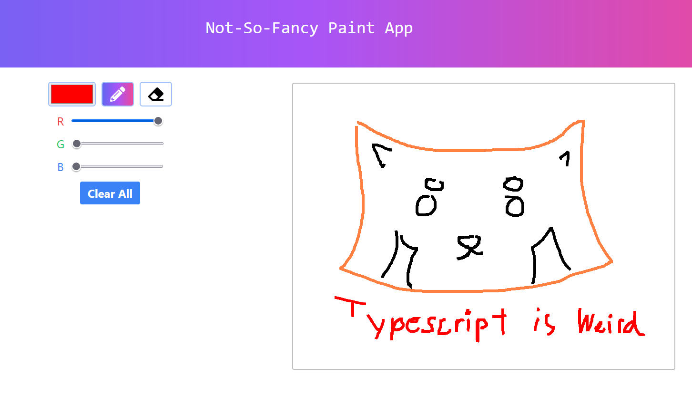

# 512-paint-svelte

This is a Svelte implementation for Lab 3 in CIS 4120/5120. It is a basic paint app used to demonstrate basic usage of Svelte for UI/UX for web development.

Website Deployment: https://512-paint-svelte.vercel.app/

